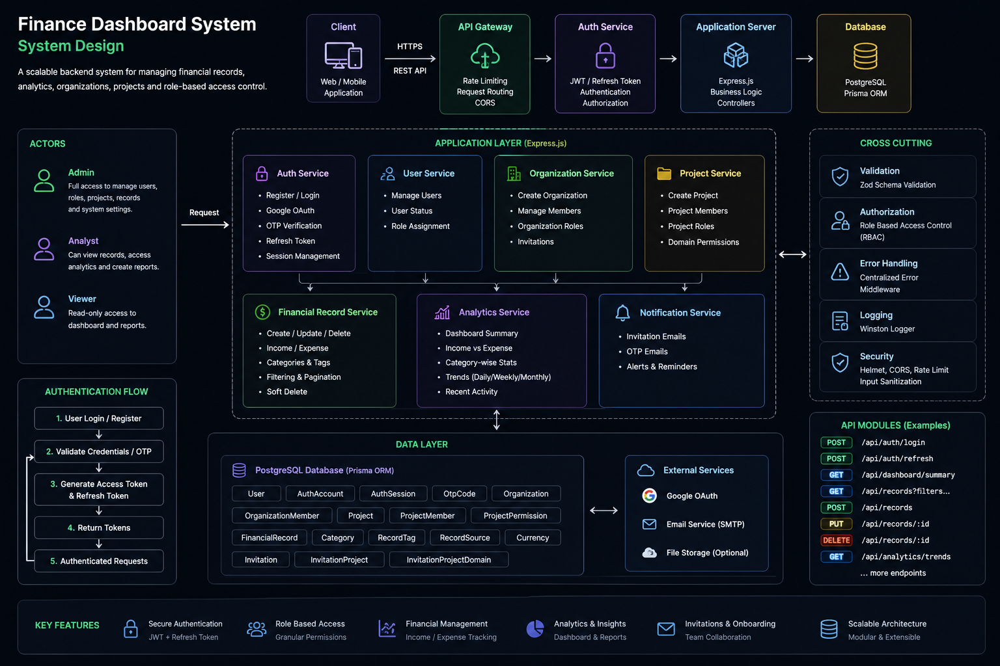

# Finance Dashboard System

A scalable finance dashboard backend built to manage financial records, analytics, organizations, projects, and role-based access control with secure authentication and dashboard APIs.

---

# System Design



---

# Features

* Authentication & Authorization

  * Email/Password Login
  * Google OAuth
  * OTP Authentication
  * JWT + Refresh Token Sessions

* Organization & Project Management

  * Multi-tenant organizations
  * Project-based collaboration
  * Invitation system
  * Role management

* Role-Based Access Control (RBAC)

  * Organization Roles
  * Project Roles
  * Domain-based permissions
  * Middleware-based authorization

* Financial Records

  * Income & Expense tracking
  * Categories & Tags
  * Filtering & Pagination
  * Soft delete support

* Dashboard Analytics

  * Total Income
  * Total Expenses
  * Net Balance
  * Category-wise analytics
  * Recent activity
  * Trends & summaries

* Developer Experience

  * Prisma ORM
  * Zod validation
  * Swagger/OpenAPI docs
  * Modular architecture
  * Centralized error handling

---

# Tech Stack

## Backend

* Node.js
* TypeScript
* Express.js

## Database

* PostgreSQL
* Prisma ORM

## Authentication

* JWT
* Google OAuth
* OTP Authentication

## Validation & Utilities

* Zod
* Swagger/OpenAPI

---

# Architecture Overview

```text
Client
   ↓
Express API
   ↓
Middleware Layer
(Auth + RBAC + Validation)
   ↓
Controllers
   ↓
Services
   ↓
Prisma ORM
   ↓
PostgreSQL
```

---

# Project Structure

```bash
src/
├── config/
├── controllers/
├── middlewares/
├── routes/
├── services/
├── utils/
├── validators/
├── prisma/
└── app.ts
```

---

# Main Database Models

* User
* AuthAccount
* AuthSession
* Organization
* OrganizationMember
* Project
* ProjectMember
* ProjectPermission
* Invitation
* FinancialRecord
* FinancialRecordCategory
* FinancialRecordTag

---

# API Modules

## Authentication

```http
POST /api/auth/login
POST /api/auth/register
POST /api/auth/refresh
POST /api/auth/logout
```

## Organizations

```http
GET    /api/organizations
POST   /api/organizations
PUT    /api/organizations/:id
DELETE /api/organizations/:id
```

## Projects

```http
GET    /api/projects
POST   /api/projects
```

## Financial Records

```http
GET    /api/records
POST   /api/records
PUT    /api/records/:id
DELETE /api/records/:id
```

## Dashboard Analytics

```http
GET /api/dashboard/summary
GET /api/dashboard/trends
GET /api/dashboard/categories
```

---

# Installation

## Clone Repository

```bash
git clone https://github.com/your-username/finance-dashboard-system.git
cd finance-dashboard-system
```

## Install Dependencies

```bash
npm install
```

## Configure Environment Variables

Create a `.env` file:

```env
DATABASE_URL=
JWT_SECRET=
GOOGLE_CLIENT_ID=
GOOGLE_CLIENT_SECRET=
RESEND_API_KEY=
```

---

# Database Setup

Run Prisma migrations:

```bash
npx prisma migrate dev
```

Generate Prisma client:

```bash
npx prisma generate
```

---

# Run Development Server

```bash
npm run dev
```

Server runs on:

```bash
http://localhost:5000
```

---

# Swagger Documentation

```bash
http://localhost:5000/docs
```

---

# Key Highlights

* Clean and scalable backend architecture
* Type-safe database queries using Prisma
* Secure authentication and authorization
* Financial analytics APIs
* Multi-tenant organization support
* Production-oriented backend practices

---

# Future Improvements

* Unit & Integration Testing
* Rate Limiting
* Audit Logs
* Background Jobs
* Real-time Analytics

---

# License

MIT License
